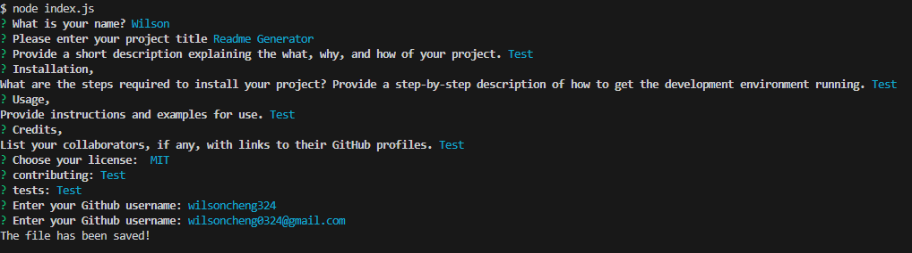
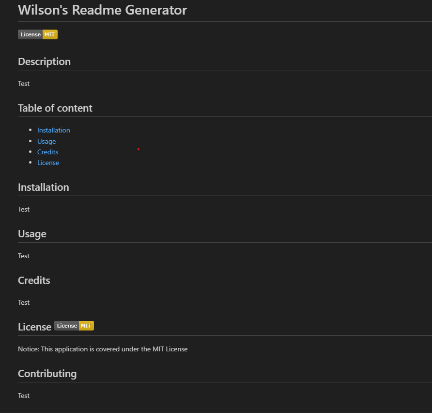

# Wilson's Readme Generator

## Description 

This Node.js application simplifies the process of crafting professional README.md documents directly from the command line, with the aim of minimizing the time developers invest in manual README.md composition. The objective is to empower developers to dedicate more time to the fundamental aspects of their projects, emphasizing creation, upkeep, and enhancements. Utilizing inquirer (a node package manager), the application leads users through a sequence of prompts, gathering crucial details such as their name, application title, description, installation guidelines, usage insights, contribution norms, testing instructions, preferred license, GitHub handle, and primary email. Upon completing these prompts, the application automatically generates a refined README.md markdown file based on the provided inputs.

## Table of content 

- [Screen Recording of Application Demo](#screen-recording-of-application-demo)
- [Screenshots](#screenshots)
- [Installation](#installation)
- [License](#license-license-unlicense)
- [Questions](#questions)

## Screen Recording of Application Demo

https://drive.google.com/file/d/1Xg8feufmMSSrHIlu99iT2bKesxst2c9O/view

## Screenshots

## Installation

1. Clone the repo.
2. Open in VS Code. Using the terminal, install node.js.
3. In the terminal, utilize the command npm init -y to initialize and create a package where project files will be stored.
4. Use the terminal to run the command npm i inquirer@8.2.4 to install v8.2.4 of the inquirer.
5. Within the terminal, type the command node index.js, to run the application.

## License 

Notice: This application is covered under the Unlicense License

## Questions

Have amy question? Click the link below to contact me.

- [Link to my Github](https://github.com/wilsoncheng324)(https://github.com/wilsoncheng324)
- <a href="wilsoncheng0324@gmail.com">wilsoncheng0324@gmail.com</a>